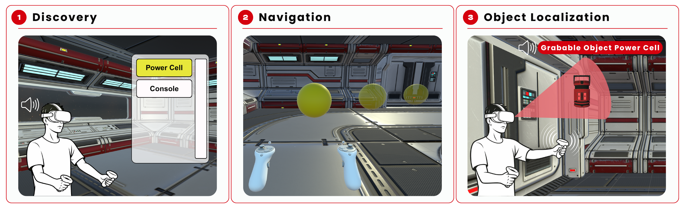

# VisionPulse

*A Virtual Reality System Enabling Accessible Discovery and Navigation for Blind and Low Vision Users*

## Abstract
Free exploration is an important aspect of many engaging virtual reality (VR) experiences, yet remains largely inaccessible to blind and low vision (BLV) users due to its reliance on visual feedback. Existing approaches support BLV navigation through prebuilt menus of environment and audio beacons, but offer limited support for free-form discovery. We present VisionPulse, an accessible VR system that enables BLV users to explore virtual environments through natural head and hand movements, combined with auditory, haptic, and text-to-speech feedback. VisionPulse introduces a discovery-driven approach that allows users to progressively uncover regions and objects, alongside navigation support through waypoint guidance and object localization via responsive audio and orientation-based haptics. A study with 12 BLV participants showed a strong preference for VisionPulse’s discovery-based exploration and multimodal feedback, without negatively impacting task performance or perceived workload. Our findings underscore the importance of accessible, free-form VR experiences, and contribute insights for inclusive VR design.

## Requirements
- Download Unity

## Setup
- Clone this repo
- Open the folder in Unity Hub